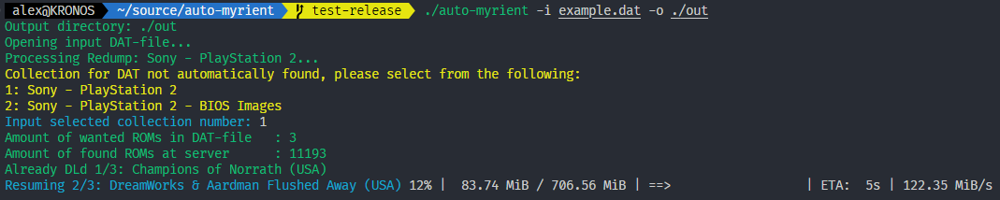

# auto-myrient
A tool for batch downloading files from [Myrient](https://myrient.erista.me/).
This project is heavily inspired by [dltool](https://github.com/kosmosnautti/dltool) and was mostly made as a pet project.

## Features

Download ROMs in bulk via provided DAT files. Supports resuming incomplete downloads.

## Usage

Download the relevant executable from releases and give it a run.
Docs are built into the tool with explanations of all parameters.
